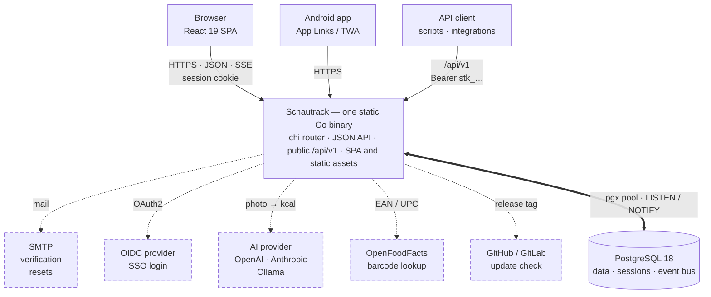
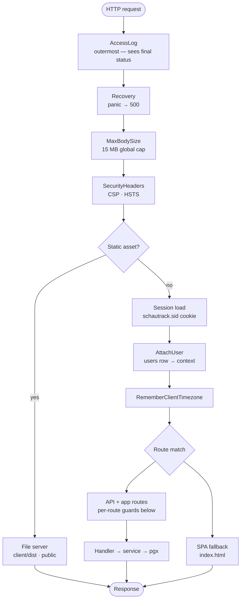
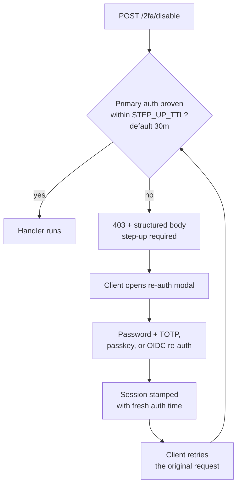
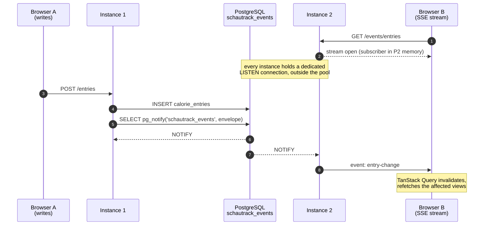
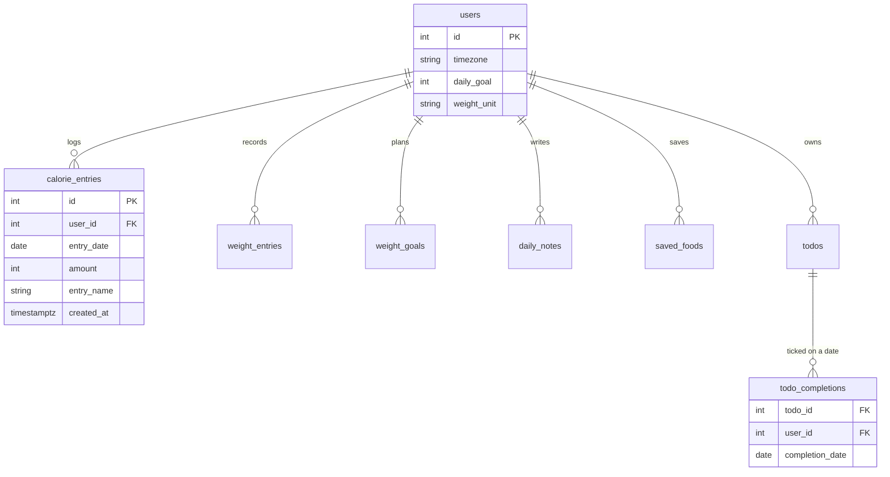
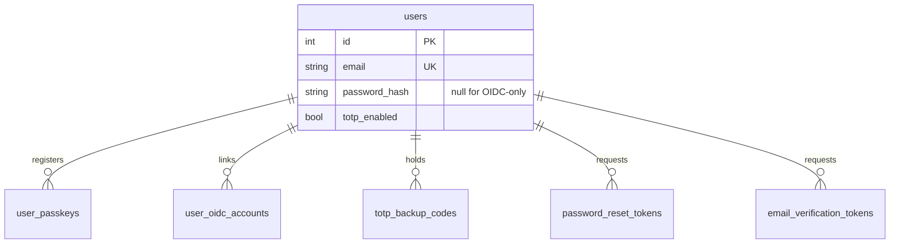
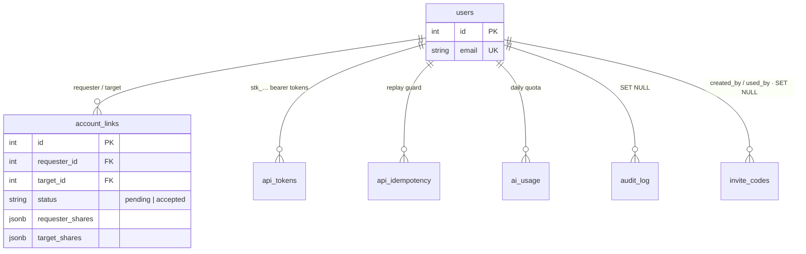
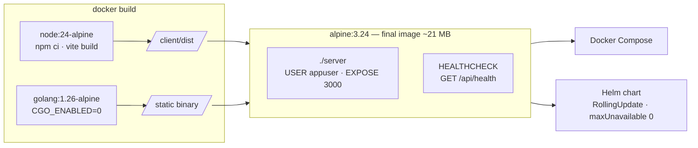

# Architecture

How Schautrack is put together, and why. Every diagram below is derived from the
code it describes — the file references next to each are the source of truth, and
if a diagram and the code ever disagree, the code wins and the diagram is a bug.

References point at **files and symbol names, never line numbers**. Line numbers
in prose rot within days of being written and rot silently, which is worse than
being vague: a reader who follows a stale line number lands on unrelated code and
has no way to tell.

- [System context](#system-context)
- [Request pipeline](#request-pipeline)
- [Authorization layers](#authorization-layers)
- [Realtime updates](#realtime-updates)
- [Data model](#data-model)
- [Build and deployment](#build-and-deployment)

---

## System context

Schautrack ships as **one process**: a single static Go binary that serves both
the JSON API and the compiled React bundle. There is no separate frontend server,
no worker, no queue, and no cache tier — PostgreSQL is the only required
dependency.

Everything drawn with a dashed border is **optional**: the app boots and runs with
none of it configured, and each feature degrades to "unavailable" rather than
failing startup.

| Dependency | Required? | Enabled by | Code |
| --- | --- | --- | --- |
| PostgreSQL | **Yes** | `DATABASE_URL` | `internal/database/pool.go` |
| SMTP | No | `SMTP_HOST` + `SMTP_FROM` | `internal/service/email.go` |
| OIDC provider | No | `OIDC_ISSUER` + client id/secret | `internal/service/oidc.go` |
| AI provider | No | `AI_KEY` (global) or a per-user key | `internal/service/ai.go` |
| OpenFoodFacts | No | `ENABLE_BARCODE` (default on) | `internal/handler/barcode.go` |
| Release API | No | `UPDATE_PROVIDER` / `UPDATE_REPO` | `internal/release/provider.go` |

A misconfigured optional dependency never takes the process down. An invalid
release source, for example, logs and falls back to the public GitHub repo rather
than exiting (the `release.New` fallback in [`cmd/server/main.go`](../cmd/server/main.go)).

The one thing that *does* abort startup is a failed schema migration
(`InitSchemaWithRetry` in [`cmd/server/main.go`](../cmd/server/main.go)) — deliberately, because
`/api/health` only pings the database. A half-migrated schema would keep probes
green while every real query 500s, and with `maxUnavailable: 0` Kubernetes would
happily retire the last healthy pod in favour of a broken one.

---

## Request pipeline

Global middleware wraps every request in the order below; per-route guards are
then layered on with `r.With(...)`. Order is load-bearing, not cosmetic.

Source: the `r.Use(...)` block in [`cmd/server/main.go`](../cmd/server/main.go).

Two details worth knowing:

**`AccessLog` is outermost on purpose.** It has to observe the status that was
actually committed — including the 500s that `Recovery` synthesises. It is the
only source of request rates, latencies and error counts this deployment has, so
a 500 that never reached the log is a 500 nobody can see.

**Static assets skip session loading entirely.** `SkipStaticAssets`
([`internal/middleware/static.go`](../internal/middleware/static.go)) wraps both
the session middleware and `AttachUser`. One
page load fans out to roughly a dozen asset requests, and each would otherwise
cost a session lookup plus a full users SELECT. Authenticated `/api/` and
`/events/` routes are never classified static, so they keep the complete
session + user pipeline.

---

## Authorization layers

There are **two independent authentication models**, and which one applies is
decided by the URL prefix:

| Surface | Authenticated by | CSRF |
| --- | --- | --- |
| The app's own routes (`/entries`, `/settings/*`, `/api/…`) | `schautrack.sid` **session cookie** | Required on every mutation |
| `/api/v1/*` — the public API | `Authorization: Bearer stk_…` **only** | Not needed at all |

`/api/v1` refuses to treat a cookie as authentication even when one is present,
and that is the entire point: cookies are attached by the browser automatically,
which is what makes CSRF possible in the first place. Because no cookie is ever
accepted there, a request forged by a third-party page cannot carry usable
credentials, and the whole surface needs no CSRF token, no double-submit and no
SameSite reasoning (`RequireAPIToken` in
[`internal/middleware/apiauth.go`](../internal/middleware/apiauth.go)).

Within each model the guards **compose per route** — there is no single fixed
chain that every request runs. Each route declares only what it needs, via
`r.With(...)`:

| Route | Guards applied |
| --- | --- |
| `POST /auth/login` | rate limit (auth) → CSRF |
| `POST /entries` | login → CSRF |
| `GET /entries/day?user=…` | login → link auth (`nutrition`) |
| `POST /api/ai/estimate` | rate limit (strict) → login |
| `POST /2fa/disable` | login → local auth → **step-up** → CSRF |
| `POST /settings/export` | login → **step-up** → CSRF |
| `POST /admin/invites` | login → admin → CSRF |
| `GET /api/v1/entries` | rate limit (IP) → **API token** → scope `entries:read` |

| Guard | Question it answers | Code |
| --- | --- | --- |
| `RateLimiter` | Too many attempts from this IP? | `internal/middleware/ratelimit.go` |
| `RequireLogin` | Is there a valid session? | `internal/middleware/auth.go` |
| `RequireLocalAuth` | Did this session log in *locally* rather than via OIDC? | `internal/middleware/auth.go` |
| `RequireStepUp` | Was primary auth proven within `STEP_UP_TTL`? | `internal/middleware/stepup.go` |
| `CsrfProtection` | Does the token match the session's? | `internal/session/csrf.go` |
| `RequireLinkAuth` | Does the target user share *this category* with me? | `internal/middleware/links.go` |
| `RequireAdmin` | Does the email match `ADMIN_EMAIL`? | `internal/middleware/auth.go` |
| `RequireAPIToken` | Is there a valid `stk_…` bearer token? (cookies rejected) | `internal/middleware/apiauth.go` |
| `RequireScope` | Does that token carry the scope this route needs? | `internal/middleware/apiauth.go` |

API tokens are scoped per resource and direction — `entries:read`,
`entries:write`, `weight:*`, `todos:*`, `foods:*`, `notes:*`
(`internal/service/apitoken.go`). `RequireScope` must be mounted **below**
`RequireAPIToken`; reaching it without a token is a routing mistake, so it fails
closed with 401 rather than assuming authorization. A token can never mint
another token, which keeps a leaked token from escalating into a permanent one.

**Step-up** is the interesting one. It gates changes to *authentication methods
themselves* — password change, enabling/disabling 2FA, regenerating backup codes,
adding or deleting passkeys, unlinking OIDC, account deletion, and whole-account
export/import. Rather than 401ing, it returns `403` with a structured body; the
client opens a re-auth modal and retries the original request once elevation
succeeds:

Note the deliberate asymmetry on passkey registration: `/passkeys/register/begin`
requires step-up but `/passkeys/register/finish` does not
(the `/passkeys/register/*` routes in [`cmd/server/main.go`](../cmd/server/main.go)). `/finish` is already
authenticated by the signed WebAuthn challenge minted during `/begin`, and
demanding step-up again would pop a second modal at users who simply took longer
than the grace window to complete their platform's passkey ceremony.

**`RequireLocalAuth`** keys off the session's `auth_method`, not off whether a
password hash exists. A session established through OIDC is refused with 403 and
"log in with a password to change authentication settings" — which is why
`/auth/oidc/step-up` is the one step-up route that deliberately omits the guard
(the `/auth/oidc/step-up` route in [`cmd/server/main.go`](../cmd/server/main.go)): it exists precisely for users
whose only auth method is OIDC.

**Link sharing** is category-scoped and read-only in both directions. Four
categories exist — `nutrition`, `weight`, `todos`, `notes`
(`ShareCategories` in [`internal/service/links.go`](../internal/service/links.go)) — and each
shared read route names the one it needs, e.g.
`RequireLinkAuth(pool, service.ShareNutrition)` on `/entries/day`. Absent or
unknown keys default to *off*.

---

## Realtime updates

This is the part of the system most likely to be misread, so it gets a diagram of
its own.

A user's SSE stream is held in the memory of whichever instance is serving that
connection. The write that should update it can land on *any* instance. With more
than one replica behind a load balancer, those are routinely not the same pod — so
delivering events straight to the local subscriber map would mean a user sees
realtime updates only when their write happens to hit the pod holding their
stream.

Events are therefore published through **Postgres `LISTEN`/`NOTIFY`**, and every
instance delivers to the subscribers it holds:

Source: `SendEvent` / `Listen` in [`internal/sse/broker.go`](../internal/sse/broker.go),
wired in [`cmd/server/main.go`](../cmd/server/main.go).

Design points:

- **The listener gets its own connection**, not one from the shared pool — a
  `LISTEN` occupies its connection permanently, and the pool is sized for request
  traffic. It reconnects with exponential backoff capped at 30s.
- **Local delivery is the fallback, never the primary path.** If Postgres is
  unreachable, or the envelope exceeds Postgres' hard 8000-byte `NOTIFY` payload
  limit, the broker serves the connections it holds and logs the degradation — a
  single-instance deployment then behaves exactly as it would have before
  cross-instance fanout existed.
- **Events are addressed per user, and fanned out to linked users.**
  `getTargets()` resolves who else should see a change, with a short-lived cache
  invalidated whenever links change.
- **The events that fan out carry no tracked data.** The four content events —
  `entry-change`, `todo-change`, `note-change`, `saved-food-change` — reach
  linked users, and carry only `{sourceUserId, at}`. They are pure
  cache-invalidation signals: the client refetches through the normal authorized
  endpoints, so a revoked share cannot leak through a stream that is already
  open. The remaining four — `settings-change`, `link-change`,
  `link-label-change`, `link-shares-change` — do carry a small payload, but each
  is addressed to a single user: their own settings, or metadata about a link
  they are party to.
- **SSE is exempt from the write deadline.** The server sets a 60s
  `WriteTimeout` for slow-loris protection; the SSE handler clears it for its own
  connection via `http.ResponseController`, and chi's `Compress` is scoped to the
  file server so it never wraps the stream.

---

## Data model

22 tables, all created by Go migrations in
[`internal/database/migrations.go`](../internal/database/migrations.go) —
`db/init.sql` is intentionally empty so migrations stay the single source of
truth.

`users` is the hub: 18 of the 22 tables carry a foreign key to it. All of them
cascade on delete except three columns — `audit_log.user_id` and
`invite_codes.created_by` / `used_by` — which null out instead, so the trail
survives the account.

Deleting an account is therefore *nearly* one statement, but not quite. It runs
in a transaction, because **`"session"` has no foreign key to `users`** and would
otherwise survive the delete, leaving another device still logged in as an
account that no longer exists. Both deletion paths — the user's own
[`DeleteAccount`](../internal/handler/auth_email.go) and the admin's
[`DeleteUser`](../internal/handler/admin.go) — clear sessions explicitly before
dropping the row.

**Tracking data** — everything the user logs:

**Identity and credentials** — how a person proves who they are:

**Access and bookkeeping** — what an authenticated identity may reach:

`account_links.status` has exactly two values, `pending` and `accepted` —
declining a request **deletes the row** rather than recording a `declined` state,
so a decline leaves nothing behind and the same pair can try again later.

Three tables are absent from all four diagrams because they stand alone, with no
foreign keys in either direction:

| Table | Holds |
| --- | --- |
| `"session"` | `sid` / `sess` JSON / `expire` — note the **singular, quoted** name; `session` is a reserved word, so it is quoted everywhere it appears ([`internal/session/store.go`](../internal/session/store.go)) |
| `admin_settings` | Runtime settings overridable from the admin panel |
| `schema_data_migrations` | Migration bookkeeping |

One more thing that trips people up: timestamps are stored UTC and rendered per
timezone at read time. Your own entries render in *your* timezone; a linked
friend's entries render in **their** timezone, so you see when they actually ate
rather than what time it was for you.

`admin_settings` is read through a 1-minute TTL cache
([`internal/database/settings.go`](../internal/database/settings.go)). For the
knobs that exist in both places, the environment variable is the override and the
database row is the fallback.

---

## Build and deployment

A three-stage Docker build keeps the runtime image at roughly 21 MB — the Node
toolchain never reaches it, and neither does the Go one.

Source: [`Dockerfile`](../Dockerfile),
[`helm/schautrack/`](../helm/schautrack/).

`/api/health` backs both the container healthcheck and the Kubernetes liveness
and readiness probes. Combined with `maxUnavailable: 0`, the old pod keeps serving
until the new one reports ready — which is exactly why a failed migration must
abort startup rather than leaving a pod that answers probes but not queries.

Signals are handled natively via `signal.NotifyContext`, so there is no
`dumb-init` in the image. Shutdown marks the health endpoint as draining, then
gives in-flight requests 30 seconds before closing the pool
(the `srv.Shutdown` block in [`cmd/server/main.go`](../cmd/server/main.go)).
